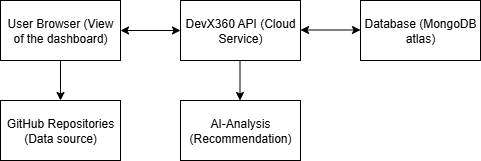

# DevX360 User Manual

## 0. How the System Works 



When you log into DevX360, you begin on the dashboard in your web browser. This dashboard is your main control panel, where you can view metrics, manage your team, and request AI feedback. Every action you take is sent to the DevX360 service running in the cloud.

The cloud service acts like a messenger. If your request is about team details or stored information, it retrieves the data from the secure database. If it’s about repositories and commits, it connects to GitHub to fetch the latest activity. Alongside this, DevX360 has an AI assistant that analyses the data coming from GitHub and your stored metrics, then provides recommendations on how your team can improve.

From the user’s perspective, this all happens seamlessly: you press a button, and the results appear on your screen. Behind the scenes, however, several parts are working together—the dashboard, the cloud service, the database, GitHub, and the AI—to make sure you always have accurate and useful insights.


When you log into DevX360, you begin on the dashboard in your web browser. This dashboard is your main control panel, where you can view metrics, manage your team, and request AI feedback. Every action you take is sent to the DevX360 service running in the cloud.

The cloud service acts like a messenger. If your request is about team details or stored information, it retrieves the data from the secure database. If it’s about repositories and commits, it connects to GitHub to fetch the latest activity. Alongside this, DevX360 has an AI assistant that analyses the data coming from GitHub and your stored metrics, then provides recommendations on how your team can improve.

From the user’s perspective, this all happens seamlessly: you press a button, and the results appear on your screen. Behind the scenes, however, several parts are working together—the dashboard, the cloud service, the database, GitHub, and the AI—to make sure you always have accurate and useful insights.

## 1. Getting Started

### 1.1 Prerequisites Before Running the App

Before launching the DevX360 app:

1. **Start the API**  
   - Follow the setup instructions in the official README:
     👉 [API Setup Guide](https://github.com/COS301-SE-2025/DevX360/tree/feature/ai-analysis#) Found in the "Installation" section of the README

2. **Run the Frontend App**
   - Navigate to the `devx360-react/src` folder:
     ```bash
     cd devx360-react/src
     ```
   - Install dependencies:
     ```bash
     npm install
     ```
   - Start the development server:
     ```bash
     npm start
     ```
### 1.2 Landing Page

1. Click "Register" if don't have an account
2. Enter your details (name, email, role etc..)
3. It is HIGHLY recommended you sign up using your github
4. If you do have a an account Click "Sign In"


### 1.3 Registration


1. Click "Sign Up" on the login page or If you clicked "Register" on the Landing Page
2. Enter your details (name, email, role)
3. Verify your email address
4. Log in with your credentials

### 1.3 Login


1. Enter email and password
2. Press Sign in


---

## 2. Overview


### 2.1 Navigation
1. **Sidebar Menu**: Access different sections
2. **User Profile**: View/update your details
3. **Theme Toggle**: Switch between light/dark mode
4. **Dashboard**: Showing your teams Metrics

### 2.2 Key Metrics
- Deployment Frequency
- Lead Time for Changes
- Change Failure Rate
- Mean Time to Recovery

---
## 3. Profile


### 3.1 Edit Profile

1. Click "Edit Profile"
2. Edit your name or email
3. Click "save changes"

### 3.1 Edit Profile Picture
1. Click "Edit" by profile picture
2. Choose the picture you want to upload

---
## 4. Team Management


### 4.1 Creating a Team

1. Navigate to Team section
2. Click "Create New Team"


3. Enter team name, password and GitHub repo URL
4. Click "Create Team"

### 4.2 Joining a Team
Click "Join team"


1. Get team name and password from your manager
2. Search for the team
3. Enter password when prompted

---

## 4. Metrics Dashboard


### 4.0 Deployment trend and top contributors


### 4.1 Understanding DORA Metrics
- **Deployment Frequency**: How often your team deploys code
- **Lead Time**: Time from commit to production
- **Change Failure Rate**: Percentage of failed deployments
- **MTTR**: How quickly you recover from failures


### 4.2 RBAC(Role Based Access Control
#### 4.2 Team Creator
if you create the team that means you have higher access than other members of a team, you are technically the "Team Manager"


You may Veiw the statistics of memebrs in the team because you have "Creator Access"


#### if you are not the "Creator" of a team then you have "Member access"


---

## 5. AI Analysis


### 5.1 Requesting Analysis
1. Navigate to Metrics dashboard
2. Wait for processing (typically 0-30 seconds)
3. View results in the AI Feedback section

### 5.2 Understanding Suggestions
AI provides recommendations on:
- Code quality improvements
- Process optimizations
- Team workflow suggestions

---
## 6. Help Menu
Click on the Question mark on right botton corner


### Shows you a variety of Help Navigations that may help you


---

## 7. Troubleshooting

### Common Issues
**Problem**: Can't see team metrics  
**Solution**: Ensure you're added to the team and have correct permissions

**Problem**: GitHub repo not connecting  
**Solution**: Check repository URL and ensure proper access rights

**Problem**: AI analysis taking too long  
**Solution**: Larger repos may take more time. Check back in 10 minutes.

**Problem**: Can not see member stats 
**Solution**: Memeber did not sign in using Github
