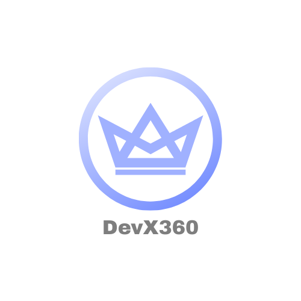

  

# DevX360: AI-Powered DevOps Analytics Platform

## 🚀 Project Description

**DevX360** is an AI-powered DevOps analytics platform that transforms DORA metrics (Deployment Frequency, Lead Time for Changes, Mean Time to Recovery, and Change Failure Rate) into actionable insights for engineering teams. Designed to address the rapid growth of the South African software industry (projected to reach USD 3.4 billion by 2030), this tool automates tracking, analysis, and visualization of critical performance indicators, enabling teams to achieve elite DevOps performance.

---

## 🔑 Key Features

- **AI-Driven Insights**:  
  - Identify performance bottlenecks via Ollama (local LLM) code analysis.
  - Predictive alerts to prevent workflow degradation.
- **Real-Time Dashboard**:  
  - Interactive visualization of team/individual metrics (React + D3.js).
  - Trend analysis and customizable benchmarks.
- **Automated Integrations**:  
  - GitHub integrations for seamless data collection.
- **Reporting**:  
  - Generate PDF/CSV reports and Slack alerts for metric deviations.

---

## 🛠 Technologies Used

| Component           | Technology/Framework                                                                                   | Justification                          |
|---------------------|--------------------------------------------------------------------------------------------------------|----------------------------------------|
| **Frontend**        |  React      | Interactive dashboards & visualization |
| **Backend**         |  Node.js (Express) | High-throughput API handling           |
| **AI Analysis(Hosted)**     |  OpenAI API | Cloud-hosted AI for lightweight, scalable analysis |
| **AI Analysis(Local)**     |  Ollama (Local LLM) | Offline, cost-free code analysis       |
| **Data Processing** | 🐙 Octokit                                                                                              | Reliable metric scheduling             |
| **Database**        |  MongoDB Atlas     | Real-time capabilities & free tier     |
| **Hosting**         |  Vercel                  | Zero-cost deployment                   |

---

We use a collaborative workflow to manage progress and documentation.

## 📄 Latest Docs
- [Project Planning and Role Allocation](https://github.com/COS301-SE-2025/DevX360/blob/main/Documentation%20V4/Project%20Planning%20and%20Role%20Allocation%20V5.pdf)
- [System Requirements Specification (SRS)](https://github.com/COS301-SE-2025/DevX360/blob/main/Documentation%20V4/SRS%20V2.5.pdf)  
- [Coding Standards Document](https://github.com/COS301-SE-2025/DevX360/blob/main/Documentation%20V4/DevX360%20Coding%20Standards%20V3.1.pdf)  
- [User Manual](https://github.com/COS301-SE-2025/DevX360/blob/feature/frontend/README.md)  
- [Architectural Requirements](https://github.com/COS301-SE-2025/DevX360/blob/main/Documentation%20V4/Architectural%20Requirements%20V4.4.pdf)  
- [Technical Installation Manual](https://github.com/COS301-SE-2025/DevX360/blob/feature/ai-analysis/README.md#installation)  
- [DevX360 Testing Policy](https://github.com/COS301-SE-2025/DevX360/blob/main/Documentation%20V4/DevX360%20Testing%20Policy%20V2.pdf)

📋 Track our progress on the [Project Board](https://github.com/COS301-SE-2025/DevX360/projects?query=is%3Aopen)

---

## 👥 Team DOSKS

  

Welcome to **Team DOSKS**! We’re final-year Computer Science students at the University of Pretoria who love all things code, data, and UX. Get to know us below:

<strong>🛡️ Sipho Sehlapelo</strong> — Currently serving as the Project Manager, UI Engineer, and Designer

- **Key Skills:** React · Full-Stack Development  
- **About Me:**  
  > “I’m in my final year studying Computer Science at UP. I’m driven by solving real-world problems with code—whether it’s building a full-stack web app in JavaScript or exploring data pipelines in Python. I love finding creative ways to bridge theory with hands-on projects.”

Find me on:

<strong>⚙️ Sibusiso Mngomezulu</strong> — Currently serving on the backend team as a Data Engineer, with major contributions to Service
Engineering

- **Key Skills:** JavaScript · Node.js · API Development  
- **About Me:**  
  > “As a final-year UP CS student, I’m passionate about designing robust backend systems. I enjoy writing clean Node.js APIs, optimizing data flows in Python, and ensuring that every service scales efficiently. I’m always curious about new patterns in distributed computing and I enjoy tinkering with open-source projects.”

Find me here:

<strong>🔗 Kelsey Hamann</strong> — Currently serving on the backend as the Integration Engineer, and partially as a Data
Engineer, Testing Engineer, and Architect.

- **Key Skills:** JavaScript · Distributed Systems  
- **About Me:**  
  > “I’m wrapping up my CS degree at UP this year, with a deep interest in distributed systems and Python scripting. I find joy in breaking down complex architectures into maintainable modules and exploring container orchestration.”

Contact me here:

<strong>🎨 David Musa-Alsien</strong> — Currently serving as the Documentation Specialist, Testing Engineer, and partially as an
Architect and DevOps Engineer.

- **Key Skills:** React · UI/UX Design  
- **About Me:**  
  > “In my final year at UP, I focus on crafting intuitive user experiences. I’m passionate about accessibility and love turning data into interactive visual stories. I enjoy seeing how I can apply the coding concepts I learn in everyday life and using my skills to benefit those around me as well as myself.”

Contact me here:

<strong>🪟 Lwando Msindo</strong> — Currently serving on the frontend as a UI Engineer.

- **Key Skills:** REST APIs · React
- **About Me:**  
  > “As a final-year Computer Science student at UP, I am passionate about how software works at its core. I enjoy shaping the logic that drives applications and designing abstractions that simplify complexity, now extending that mindset into UI/UX design.”

Contact me here:

Contact us here:

📧 **Team Email:** doskscapstone17@gmail.com

# DevX360

---
